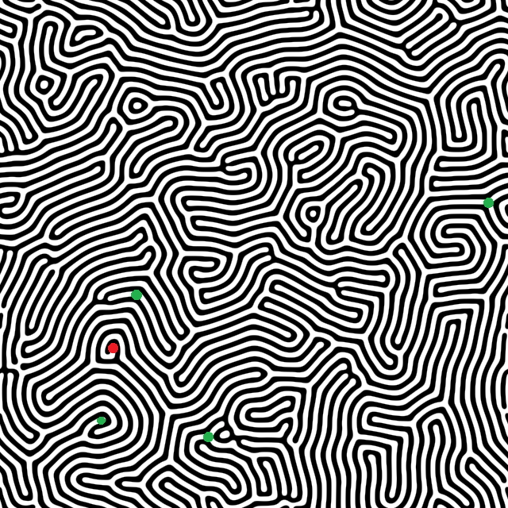
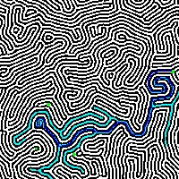

 # Problemas de Busqueda
 ## Inteligencia Artifical - Laboratorio 01
Guillermo Santos - 191517
<hr>

# Como utilizar el programa
El programa necesita una imagen como input para poder analizarla y encontrar el camino.
La imagen debe estar en el directorio raíz y debe de tener formato png o bmp. El comando para correr el programa es:

```python main.py <nombre_imagen> <algoritmo: bfs | dfs | as> <heuristica>```

Donde:
1. `<nombre_imagen>` es el nombre del archivo input. Este debe contener el formato. Por ejemplo: `test.png`
2. `<algoritmo>` es el nombre del algoritmo. Este puede ser cualquiera de las siguientes opciones:
   1. `bfs` para Breadth First Search
   2. `dfs` para Depth First Search
   3. `as` para A*

# Output esperado
Para el siguiente input, el output es una imagen que muestra en azul el camino encontrado.

